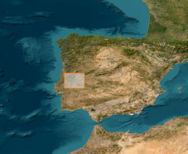

# Computer-Science-Project-2026
My submission for the Leaving certificate computer science project.

Some notes to self i might need later:

    The coordinate areas of my FIRMS and nasa POWER data selections are: 
        
        W: -8.5
        N: 40.3
        E: -6.8
        S: 39.0
        This is a central portugal/west ish area that should have both many fire condtions in summer and not too many in winter, so should be good for learning boundaries or even regression if i want aslong as i exclude date to prevent seasonal shortcuts learned.

    limitations:
        trained on portugal data, differing in vegetiation land cover human acitivty and a generally different climate. 
        FIRMS is going to be a binary fire/nofire, and the model trains on that. Does it even
        repersent risk????? gulp.. FIXED went for classes 0-3 instead of 0/1
        SMAP is coming back as some wierd file format. Only points come back as csvs, so im gonna have to average a few to prevent bias.... ARGH

    SMAP points:
        centre: -7.65, 39.65
        northwest ish: -8.15, 40.0
        northeast ish: -7.15, 40.0
        southwest ish: -8.15, 39.3
        southeast ish: -7.15, 39.3